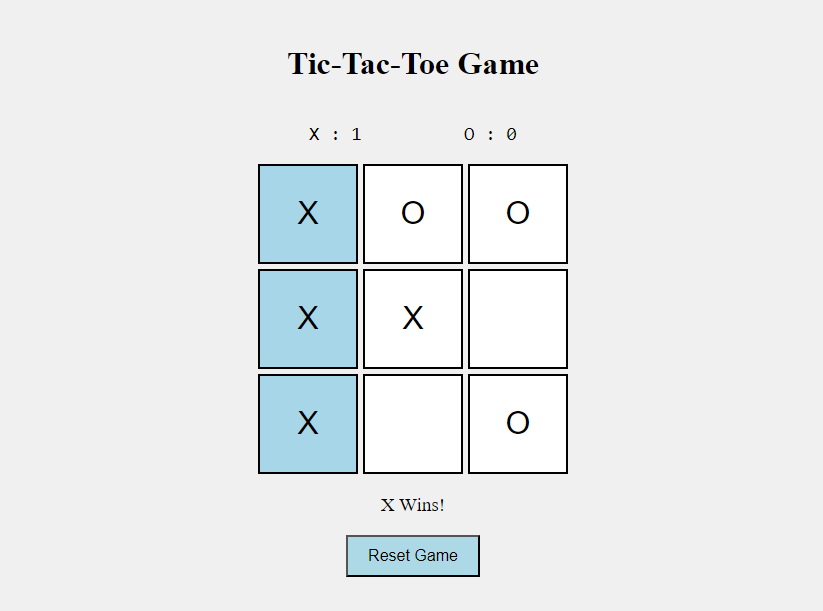

# Tic-Tac-Toe Game

🎮 **A Simple Tic-Tac-Toe Game Built with HTML, CSS, and JavaScript**

## 📖 Overview

This project is a web-based implementation of the classic Tic-Tac-Toe game, allowing two players to take turns playing on a 3x3 grid. The game checks for win conditions, highlights the winning combination, and keeps track of the score for both players. A reset functionality is also provided to start a new game while maintaining the score.

## 🌟 Features

- **Interactive Gameplay**: Players can make their moves by clicking on the grid. The game automatically switches turns between player X and player O.
- **Win Detection**: The game detects when a player wins and highlights the winning cells. It also declares a draw if all cells are filled without a winner.
- **Score Tracking**: Keeps track of the score for both players throughout multiple rounds.
- **Responsive Design**: The game is designed to work smoothly on different screen sizes and devices.
- **Reset Functionality**: The game can be reset to start a new round while preserving the score.

## 🚀 Demo

You can play the game [here](https://mahmoudelshiha.github.io/Tic-Tac-Toe-Game/).

## 🛠️ Technologies Used

- **HTML5**: For structuring the content.
- **CSS3**: For styling the game interface.
- **JavaScript**: For game logic, interaction, and dynamic updates.

## Setup

1. Clone the repository: `git clone https://github.com/MahmoudElshiha/Tic-Tac-Toe-Game.git`
2. Open `index.html` in your web browser to play the game.

## Screenshot

